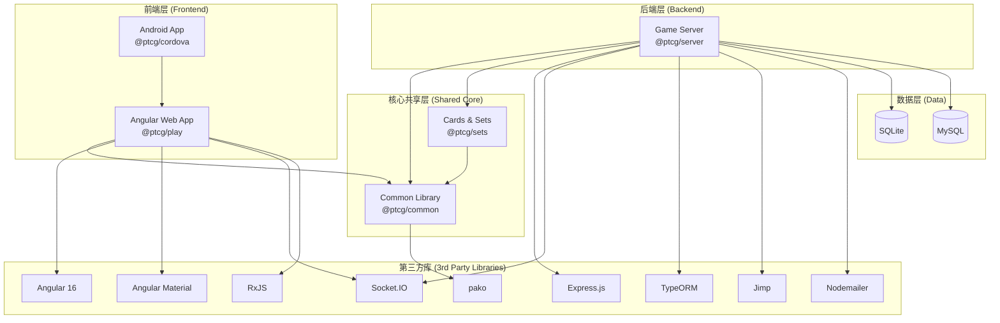
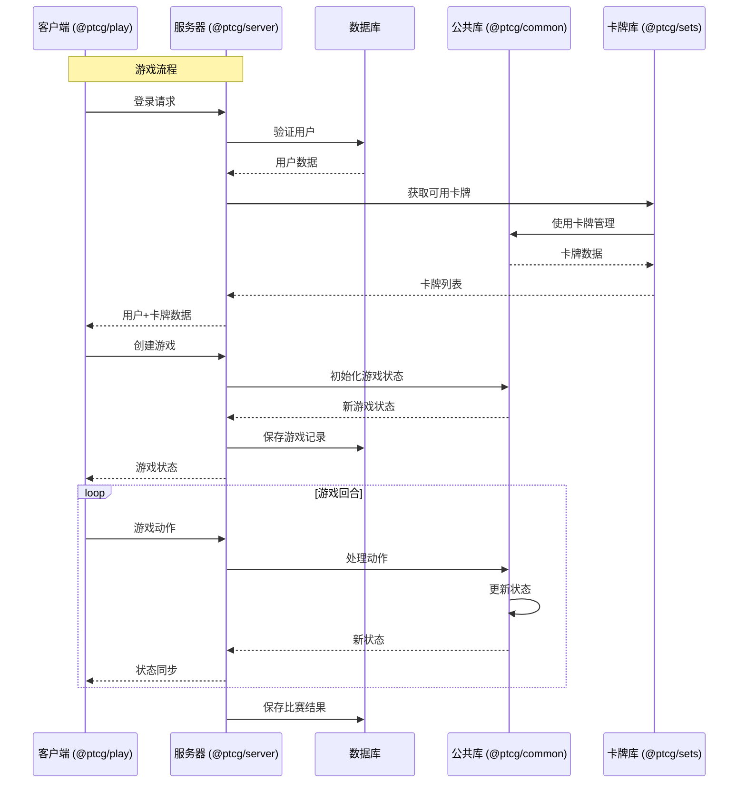

# RyuuPlay 依赖关系图

## 1. 包之间的依赖关系图

### Mermaid 可视化图

```mermaid
graph TD
    Root[根项目<br>/workspace/package.json] -->|依赖| Server[@ptcg/server<br>packages/server]
    Root -->|依赖| Sets[@ptcg/sets<br>packages/sets]
    
    Server -->|依赖| Common[@ptcg/common<br>packages/common]
    Server -->|依赖| Sets
    
    Sets -->|依赖| Common
    
    Play[@ptcg/play<br>packages/play] -->|依赖| Common
    
    Cordova[@ptcg/cordova<br>packages/cordova] -->|构建来源| Play
    
    classDef root fill:#e1f5ff,stroke:#333,stroke-width:2px;
    classDef package fill:#f0f0f0,stroke:#333,stroke-width:2px;
    class Root root;
    class Server,Sets,Common,Play,Cordova package;
```

### ASCII 艺术图

```
                    ┌─────────────────────┐
                    │   根项目 (root)      │
                    │  /workspace/         │
                    └──────────┬──────────┘
                               │
                ┌──────────────┴──────────────┐
                │                             │
                ▼                             ▼
    ┌───────────────────────┐    ┌───────────────────────┐
    │   @ptcg/server        │    │   @ptcg/sets          │
    │  packages/server      │    │  packages/sets        │
    └──────────┬────────────┘    └───────────┬───────────┘
               │                             │
               └──────────┬──────────────────┘
                          │
                          ▼
              ┌───────────────────────┐
              │   @ptcg/common        │
              │  packages/common      │
              └───────────────────────┘
                          ▲
                          │
              ┌───────────┴───────────┐
              │                       │
              ▼                       ▼
    ┌───────────────────────┐   ┌───────────────────────┐
    │   @ptcg/play          │   │   @ptcg/cordova       │
    │  packages/play        │   │  packages/cordova     │
    └───────────────────────┘   └───────────┬───────────┘
                                              │
                                              ▼
                                     (构建来源)
```

---

## 2. 包内部与第三方依赖关系图

### @ptcg/common 依赖

```mermaid
graph LR
    Common[@ptcg/common] -->|依赖| Pako[@progress/pako-esm<br>压缩]
    
    Common -->|dev依赖| TypeScript[TypeScript<br>~4.9.5]
    Common -->|dev依赖| ESLint[ESLint<br>^8.31.1]
    Common -->|dev依赖| Jasmine[Jasmine<br>^3.9.0]
```

### @ptcg/sets 依赖

```mermaid
graph LR
    Sets[@ptcg/sets] -->|依赖| Common[@ptcg/common]
    
    Sets -->|dev依赖| TypeScript[TypeScript<br>~4.9.5]
    Sets -->|dev依赖| ESLint[ESLint<br>^8.31.1]
    Sets -->|dev依赖| Jasmine[Jasmine<br>^3.9.0]
```

### @ptcg/server 依赖

```mermaid
graph LR
    Server[@ptcg/server] -->|依赖| Common[@ptcg/common]
    Server -->|依赖| Sets[@ptcg/sets]
    
    Server -->|依赖| Express[Express<br>^4.17.1<br>Web服务器]
    Server -->|依赖| SocketIO[Socket.IO<br>^4.8.1<br>WebSocket]
    Server -->|依赖| TypeORM[TypeORM<br>^0.3.22<br>数据库ORM]
    Server -->|依赖| SQLite3[SQLite3<br>^5.0.2<br>数据库]
    Server -->|依赖| MySQL[MySQL<br>^2.18.1<br>数据库]
    Server -->|依赖| Nodemailer[Nodemailer<br>^6.6.5<br>邮件]
    Server -->|依赖| Jimp[Jimp<br>^0.16.1<br>图像处理]
    Server -->|依赖| ReflectMetadata[reflect-metadata<br>^0.2.2]
    
    Server -->|dev依赖| TypeScript[TypeScript<br>~4.9.5]
    Server -->|dev依赖| ESLint[ESLint<br>^8.31.1]
    Server -->|dev依赖| Jasmine[Jasmine<br>^3.9.0]
    Server -->|dev依赖| Nodemon[Nodemon<br>^2.0.13<br>开发工具]
```

### @ptcg/play 依赖

```mermaid
graph LR
    Play[@ptcg/play] -->|依赖| Common[@ptcg/common]
    
    Play -->|依赖| Angular[Angular<br>^16.2.12<br>框架]
    Play -->|依赖| AngularMaterial[Angular Material<br>^16.2.14<br>UI组件]
    Play -->|依赖| AngularCDK[Angular CDK<br>^16.2.14]
    Play -->|依赖| NgDnD[@ng-dnd/core<br>^2.0.0<br>拖拽]
    Play -->|依赖| NgTranslate[@ngx-translate/core<br>^15.0.0<br>国际化]
    Play -->|依赖| SocketIOClient[socket.io-client<br>^4.2.0]
    Play -->|依赖| RxJS[RxJS<br>^7.8.2<br>响应式]
    Play -->|依赖| ZoneJS[zone.js<br>~0.13.3]
    Play -->|依赖| ImgCache[imgcache.js<br>^1.1.1<br>图像缓存]
    
    Play -->|dev依赖| AngularCLI[Angular CLI<br>^16.2.16]
    Play -->|dev依赖| TypeScript[TypeScript<br>~4.9.5]
    Play -->|dev依赖| ESLint[ESLint<br>^8.31.1]
    Play -->|dev依赖| JasmineCore[jasmine-core<br>~4.6.0]
    Play -->|dev依赖| Karma[Karma<br>~6.4.0<br>测试]
```

### @ptcg/cordova 依赖

```mermaid
graph LR
    Cordova[@ptcg/cordova] -->|dev依赖| CordovaLib[Cordova<br>^11.0.0]
    Cordova -->|dev依赖| CordovaAndroid[cordova-android<br>^9.1.0]
    Cordova -->|dev依赖| CordovaBrowser[cordova-browser<br>^6.0.0]
    
    %% Cordova 插件
    Cordova -->|插件| File[cordova-plugin-file<br>^6.0.2]
    Cordova -->|插件| FileTransfer[cordova-plugin-file-transfer<br>^1.7.1]
    Cordova -->|插件| Device[cordova-plugin-device<br>^2.0.3]
    Cordova -->|插件| SaveDialog[cordova-plugin-save-dialog<br>^2.0.1]
    Cordova -->|插件| PowerManagement[cordova-plugin-powermanagement<br>^1.0.5]
    Cordova -->|插件| StatusBar[cordova-plugin-statusbar-patched]
    Cordova -->|插件| Whitelist[cordova-plugin-whitelist<br>^1.3.4]
```

---

## 3. 完整的技术栈依赖图



---

## 4. 数据流与依赖关系

### 游戏数据流向图



---

## 5. 文件结构依赖关系

### 核心文件之间的依赖

```
/workspace
├── package.json (根配置)
│
├── init.js (初始化，依赖 server 和 common)
│   ├── @ptcg/server
│   │   └── @ptcg/common
│   └── @ptcg/sets
│       └── @ptcg/common
│
├── packages/
│   ├── common/ (共享核心)
│   │   └── package.json
│   │
│   ├── sets/ (依赖 common)
│   │   └── package.json → @ptcg/common
│   │
│   ├── server/ (依赖 common 和 sets)
│   │   ├── package.json
│   │   │   ├── @ptcg/common
│   │   │   └── @ptcg/sets
│   │   └── src/config.ts (服务器配置)
│   │
│   ├── play/ (依赖 common)
│   │   ├── package.json → @ptcg/common
│   │   └── src/environments/environment.ts (客户端配置)
│   │
│   └── cordova/ (依赖 play 构建结果)
│       └── package.json
│
└── docker/ (Docker 部署配置)
```

---

## 依赖关系总结

| 层级 | 包 | 主要依赖 |
|------|-----|---------|
| **根项目** | `/workspace` | `@ptcg/server`, `@ptcg/sets` |
| **服务端** | `@ptcg/server` | `@ptcg/common`, `@ptcg/sets`, Express, Socket.IO, TypeORM |
| **卡牌库** | `@ptcg/sets` | `@ptcg/common` |
| **共享库** | `@ptcg/common` | `@progress/pako-esm` |
| **Web 前端** | `@ptcg/play` | `@ptcg/common`, Angular 16, Socket.IO 客户端 |
| **Android 包装** | `@ptcg/cordova` | 依赖 `@ptcg/play` 构建产物 |

---

*最后更新: 2026-05-30*
